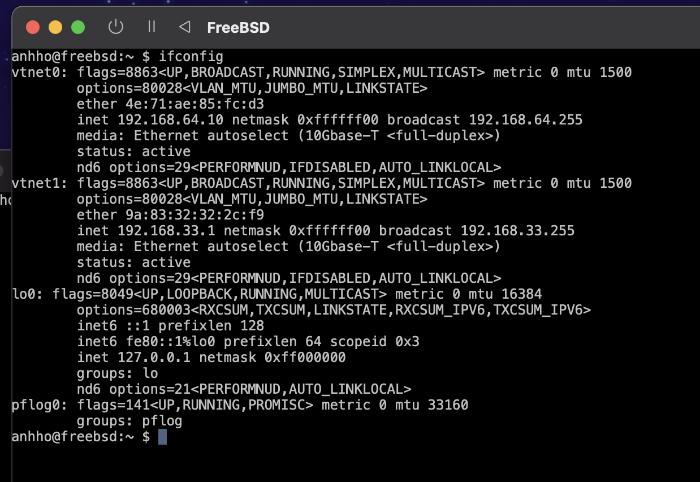

# Installation Steps

## Install UTM Software on Mac

1. Open the terminal on Mac and install UTM by using the following command:
    ```
    brew install --cask utm
    ```

## Install FreeBSD VM

1. Download the FreeBSD image using the following command:
    ```
    $ curl -LO https://download.freebsd.org/ftp/releases/ISO-IMAGES/13.2/FreeBSD-13.2-RELEASE-arm64-aarch64-dvd1.iso.xz
    ```

2. Uncompress the image:
    ```
    $ xz --decompress --verbose FreeBSD-13.2-RELEASE-arm64-aarch64-dvd1.iso.xz
    ```

3. Check the image's checksum:
    ```
    $ shasum -a 512 --tag FreeBSD-13.2-RELEASE-arm64-aarch64-dvd1.iso
    ```

4. Create a new VM in UTM, following the professor's instructions exactly.

5. After creating the username and password, the FreeBSD machine is set up. Remove the USB drive from the drives and start the VM.

6. Test to ensure it has an internet connection by using the command `ping google.com` for testing purposes.

7. Download the setup script directly from the FreeBSD terminal. Make sure to log in as "root" to install the package.
    ```bash
    # pkg install curl
    # curl -LO https://raw.githubusercontent.com/dkmcgrath/sysadmin/main/freebsd_setup.sh
    ```

8. Back in the FreeBSD terminal, update the names of WAN and LAN:
    ```bash
    $ sed -i '' 's/WAN="hn0"/WAN="vtnet0"/g' freebsd_setup.sh
    $ sed -i '' 's/LAN="hn1"/LAN="vtnet1"/g' freebsd_setup.sh
    ```

9. Once steps 8 and 9 are completed, run the script using the command `sh freebsd_setup.sh`. This may take a bit of time.

10. Test using the command `ifconfig`.

***Here is a screenshot of `ifconfig` for testing purposes after successfully set up the FreeBSD VM: 



## Install the Ubuntu VM

1. Download the installation file of Ubuntu. For Apple Silicon Macs, use Ubuntu Server for ARM.

2. Choose the base for the installation: Ubuntu Server.

3. Pick a language and keyboard layout (e.g., English) and hit "Done" to proceed.

4. Configure network connections to ensure it connects to DHCPv4 with an IP address format like 192.168.33.74/24. If not configured correctly, repeat the process until the DHCPv4 is as expected.

5. Leave the proxy input empty and hit "Done."

6. Wait for the tests to pass for the minor location, then hit "Done."

7. Update to a new installer.

8. Guided storage configuration - keep it as default and then hit "Done" twice.

9. Confirm the destructive action by hitting "Continue."

10. Set up the profile - fill out all the information and remember your username and password to log in to Ubuntu later.

11. Upgrade to Ubuntu Pro (optional).

12. SSH setup: Leave it empty and hit "Done."

13. Featured server snaps: Leave all the checkboxes empty and hit "Done."

14. Wait for the installation and updates to complete until it shows "Reboot Now." Hit "Reboot Now."

15. Shutdown the Ubuntu VM and close it. Open its settings, delete the USB drive in drives and display in devices. Hit “+New…” to add a new “Serial” for the devices. Hit "Save" after making all adjustments so you can adjust the screen size and scroll up and down on the terminal.

16. Start the Ubuntu VM again for testing. After loading everything, log in with the username and password you created during the setup process.

***Here is a screenshot of `ip a s` for testing purposes after successfully set up the Ubuntu VM: 


## Ubuntu Configuration

### Connectivity
1. **Getting an IP address:**

   Check the IP address from the FreeBSD VM using the `ifconfig` command, as shown in the attached screenshot.

   Check the IP address from the Ubuntu VM using the `ip a s` command, as shown in the attached screenshot.

2. **Connecting via SSH from your host system:**

   - On the FreeBSD system, ensure that `sshd_enable="YES"` is in `/etc/rc.conf` using the command `cat /etc/rc.conf`. If not, add or edit it using the command `vi /etc/rc.conf`, then start the SSH server using `service sshd start`. If the SSH server is already running, a message like `sshd already running? (pid=1453)` will be displayed.

   - On the Ubuntu system, the SSH server is usually already running. If not, you can start it with:
     ```bash
     $ sudo systemctl enable ssh
     $ sudo systemctl start ssh
     ```

   - On your host system (Mac), edit the `~/.ssh/config` file to ensure that the bastion server is your FreeBSD VM. Open the terminal on your Mac and use the command `nano ~/.ssh/config` to add a new host in the file. 
   - My final ssh configuration (`~/.ssh/config`)has been attached in this screenshot that showed how I have set up a hostname, host jump configured below:
    
### SSH Key Generation:
1. **Generate a key on your local machine:**
   
   Generate a key on your local machine using the command:
   ```bash
   $ ssh-keygen -t ed25519
### Copying the Public Key to FreeBSD and Ubuntu:

Copy the public key from my local machine (MAC) to the FreeBSD system and Ubuntu system to enable passwordless SSH login.

- For FreeBSD, run the following command on your local machine:

    ```bash
    $ ssh-copy-id -i ~/.ssh/id_ed25519.pub anhho@192.168.64.10
    ```

- For Ubuntu, run the following command on FreeBSD:

    ```bash
    $ ssh-copy-id -i ~/.ssh/authorized_keys anhho@192.168.33.135
    ```

## Testing SSH Connection on my local machine (MAC):

- Test the SSH connection from my local machine:

    ```bash
    $ ssh ubuntu
    ```
- I have successfully remoted in from my local machine to Ubuntu without entering any password from the FreeBSD VM and Ubuntu VM. 


# System Configuration Guide on the Ubuntu VM

## Update and Upgrade
- To ensure your system is up to date on the ubuntu VM, run the following commands:

    ```bash
    sudo apt update
    sudo apt upgrade -y
    ```

## Expand the Filesystem

- Extend the root logical volume to use all available disk space:

    ```bash
    $ sudo lvextend --extents +100%FREE /dev/ubuntu-vg/ubuntu-lv --resizefs
    ```
## Install useful tools

- Install essential tools for configuring the Ubuntu system:

    ```bash
    $ sudo apt install podman docker.io zsh tmux ruby-dev fonts-inconsolata autojump bat emacs build-essential cowsay figlet filters fortunes dos2unix containerd python3-pip cargo cmake
    ```
